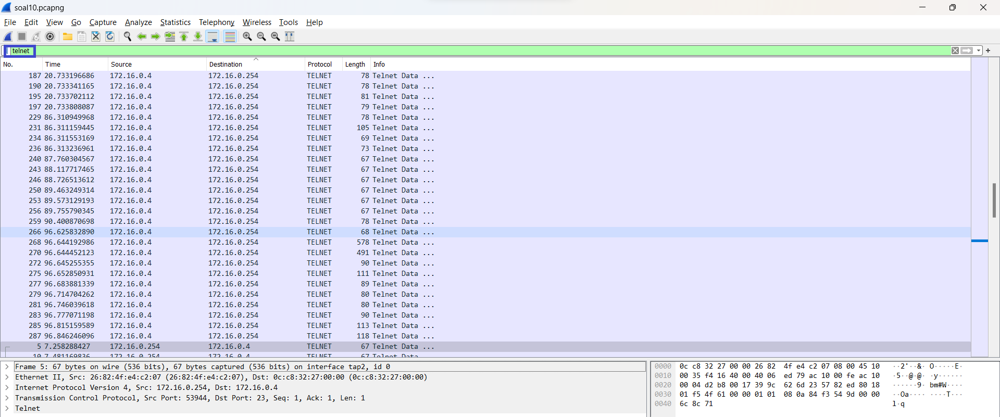
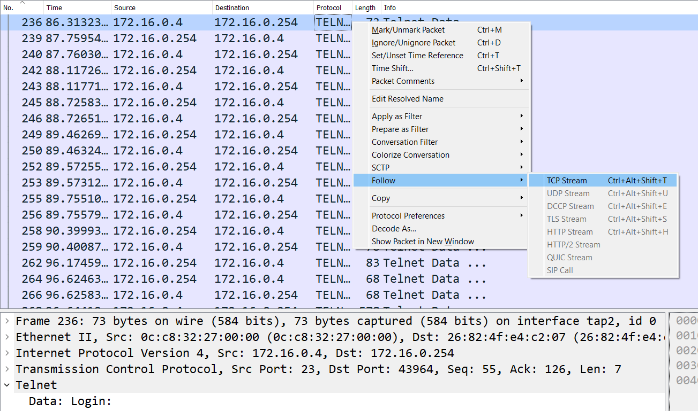
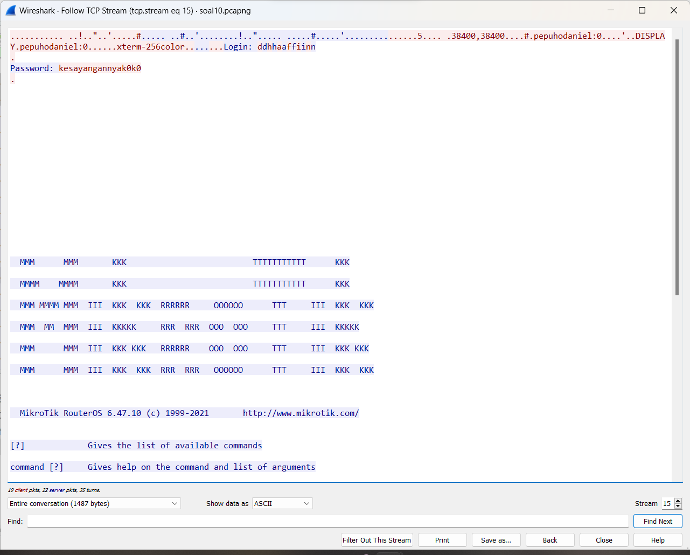

# Laporan Resmi Modul 1 Praktikum Jaringan Komputer

## Kelompok B18

|          Nama          |    NRP     |
| :--------------------: | :--------: |
| Shazia Ingeyla Naveeda | 5025211203 |
|  Aryan Shafa Wardana   | 5025211031 |

## Pembahasan

### Nomor 1

#### Soal

User melakukan berbagai aktivitas dengan menggunakan protokol FTP. Salah satunya adalah mengunggah suatu file.

<ol type="a">
    <li>
        Berapakah sequence number (raw) pada packet yang menunjukkan aktivitas tersebut?
    </li>
    <li>
        Berapakah acknowledge number (raw) pada packet yang menunjukkan aktivitas tersebut?
    </li>
    <li>
        Berapakah sequence number (raw) pada packet yang menunjukkan response dari aktivitas tersebut?
    </li>
    <li>
        Berapakah acknowledge number (raw) pada packet yang menunjukkan response dari aktivitas tersebut?
    </li>
</ol>

#### Pembahasan

### Nomor 2

#### Soal

Sebutkan web server yang digunakan pada portal praktikum Jaringan Komputer!

#### Pembahasan

### Nomor 3

#### Soal

Dapin sedang belajar analisis jaringan. Bantulah Dapin untuk mengerjakan soal berikut:

<ol type="a">
    <li>
        Berapa banyak paket yang tercapture dengan IP source maupun destination address adalah 239.255.255.250 dengan port 3702?
    </li>
    <li>
        Protokol layer transport apa yang digunakan?
    </li>
</ol>

#### Pembahasn

### Nomor 4

#### Soal

Berapa nilai checksum yang didapat dari header pada paket nomor 130?

#### Pembahasan

### Nomor 5

#### Soal

Elshe menemukan suatu file packet capture yang menarik. Bantulah Elshe untuk menganalisis file packet capture tersebut.

<ol type="a">
    <li>
        Berapa banyak packet yang berhasil di capture dari file pcap tersebut?
    </li>
    <li>
        Port berapakah pada server yang digunakan untuk service SMTP?
    </li>
    <li>
        Dari semua alamat IP yang tercapture, IP berapakah yang merupakan public IP?
    </li>
</ol>

#### Pembahasan

### Nomor 6

#### Soal

Seorang anak bernama Udin Berteman dengan SlameT yang merupakan seorang penggemar film detektif. sebagai teman yang baik, Ia selalu mengajak slamet untuk bermain valoranT bersama. suatu malam, terjadi sebuah hal yang tak terdUga. ketika udin mereka membuka game tersebut, laptop udin menunjukkan sebuah field text dan Sebuah kode Invalid bertuliskan "server SOURCE ADDRESS 7812 is invalid". ketika ditelusuri di google, hasil pencarian hanya menampilkan a1 e5 u21. jiwa detektif slamet pun bergejolak. bantulah udin dan slamet untuk menemukan solusi kode error tersebut.

#### Pembahasan

### Nomor 7

#### Soal

Berapa jumlah packet yang menuju IP 184.87.193.88?

#### Pembahasan

### Nomor 8

#### Soal

Berikan kueri filter sehingga wireshark hanya mengambil semua protokol paket yang menuju port 80! (Jika terdapat lebih dari 1 port, maka urutkan sesuai dengan abjad)

#### Pembahasan

### Nomor 9

#### Soal

Berikan kueri filter sehingga wireshark hanya mengambil paket yang berasal dari alamat 10.51.40.1 tetapi tidak menuju ke alamat 10.39.55.34!

#### Pembahasan

### Nomor 10

#### Soal

Sebutkan kredensial yang benar ketika user mencoba login menggunakan Telnet

#### Pembahasan

Dengan menggunakan aplikasi Wireshark, kita bisa menampilkan semua paket yang menggunakan protokol dengan memasukkan `telnet` pada display filter.

Kemudian, ketika menelusuri paket satu per satu, ditemukan pada paket nomor 236 terdapat data `Login: `. Dengan melakukan follow TCP Stream seperti gambar di bawah ini, kita bisa melihat data yang terkirim antara IP 172.16.0.4 (ter-highlight biru) dan IP 172.16.0.254 (ter-highlight merah).

Dari data tersebut kita bisa mengetahui bahwa kredensial yang benar adalah `dhafin:kesayangannyak0k0`
