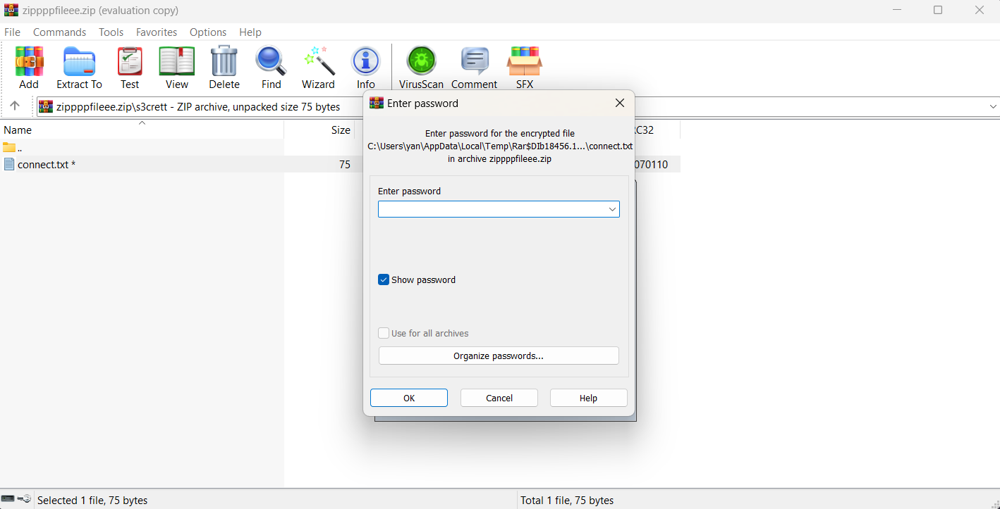
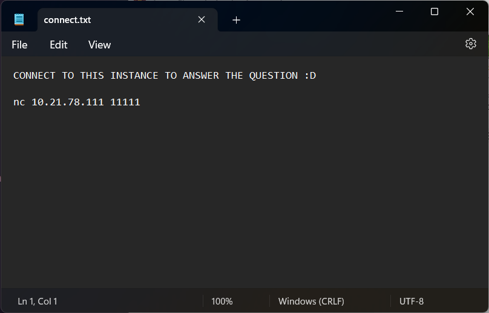
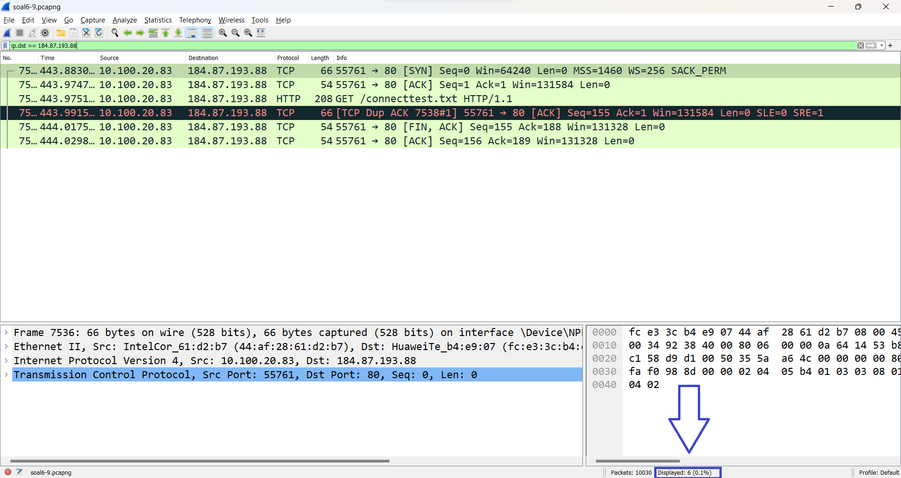

# Laporan Resmi Modul 1 Praktikum Jaringan Komputer

## Kelompok B18

|          Nama          |    NRP     |
| :--------------------: | :--------: |
| Shazia Ingeyla Naveeda | 5025211203 |
|  Aryan Shafa Wardana   | 5025211031 |

## Pembahasan

### Nomor 1

#### Soal

User melakukan berbagai aktivitas dengan menggunakan protokol FTP. Salah satunya adalah mengunggah suatu file.

<ol type="a">
    <li>
        Berapakah sequence number (raw) pada packet yang menunjukkan aktivitas tersebut?
    </li>
    <li>
        Berapakah acknowledge number (raw) pada packet yang menunjukkan aktivitas tersebut?
    </li>
    <li>
        Berapakah sequence number (raw) pada packet yang menunjukkan response dari aktivitas tersebut?
    </li>
    <li>
        Berapakah acknowledge number (raw) pada packet yang menunjukkan response dari aktivitas tersebut?
    </li>
</ol>

#### Pembahasan

Soal No. 1 hanya difokuskan pada **aktivitas mengunggah file**, jadi akan dicari paket yang melakukan perintah **STOR** dengan filtering menggunakan `ftp.request.command == "STOR"`


Akan muncul paket No.147 melakukan **Request** dengan perintah **STOR**. Lalu click paket tersebut dan lakukan drop down pada **Transmission Control Protocol** maka akan terlihat Sequence number (raw) dan Acknowledgement number (raw) untuk aktivitas pengunggahan file.

```
Sequence Number (raw): 258040667
Acknowledgment number (raw): 1044861039
```

Aktivitas pengunggahan file tersebut dalam bentuk file .zip. Maka kita akan mencari paket response yang berbentuk file .zip dan file tersebut adalah paket No. 149.


Lakukan hal yang sama seperti paket No. 147, drop down pada **Transmission Control Protocol** maka akan terlihat Sequence number (raw) dan Acknowledgement number (raw) untuk response dari aktivitas pengunggahan file tersebut.

```
Sequence Number (raw): 1044861039
Acknowledgment number (raw): 258040696
```

### Nomor 2

#### Soal

Sebutkan web server yang digunakan pada portal praktikum Jaringan Komputer!

#### Pembahasan

Karena hanya diminta unuk mencari web server untuk portal praktikum Jaringan Komputer maka kita akan melakukan filtering khusus mencari file yang terdapat **Jaringan Komputer** di paketnya dengan `frame contains "Jaringan Komputer"`. Lalu lakukan follow TCP Stream dan setelah itu kita dapat melihat server yang digunakan yaitu `gunicorn`.


### Nomor 3

#### Soal

Dapin sedang belajar analisis jaringan. Bantulah Dapin untuk mengerjakan soal berikut:

<ol type="a">
    <li>
        Berapa banyak paket yang tercapture dengan IP source maupun destination address adalah 239.255.255.250 dengan port 3702?
    </li>
    <li>
        Protokol layer transport apa yang digunakan?
    </li>
</ol>

#### Pembahasn

Kita akan melakukan filtering untuk menemukan paket yang tercapture dengan IP source maupun destination address adalah 239.255.255.250 dengan port 3702 dengan menggunakan `ip.addr == 239.255.255.250 and udp.port == 3702` maka akan muncul semua paket yang memenuhi persyaratan tersebut


Lalu untung berapa banyak paket kita bisa hitung manual atau bisa dengan cara membuka **Statistics** dan memilih **Capture File Properties** atau bisa juga dengan shortcut ` Ctrl + Alt + Shift + C` dan kita akan mendapatkan jumlah banyak paket yang sedang terlihat yaitu `21` dan seperti yang bisa dilihat protokol yang digunakan adalah `UDP`


### Nomor 4

#### Soal

Berapa nilai checksum yang didapat dari header pada paket nomor 130?

#### Pembahasan

Agar mempermudah, lakukan filtering agar hanya terlihat paket No. 130 dengan menggunakan `frame.number==130` lalu lakukan drop down pada **User Datagram Protocol**. Maka akan terlihat nilai checksumnya yaitu `0x18e5`


### Nomor 5

#### Soal

Elshe menemukan suatu file packet capture yang menarik. Bantulah Elshe untuk menganalisis file packet capture tersebut.

<ol type="a">
    <li>
        Berapa banyak packet yang berhasil di capture dari file pcap tersebut?
    </li>
    <li>
        Port berapakah pada server yang digunakan untuk service SMTP?
    </li>
    <li>
        Dari semua alamat IP yang tercapture, IP berapakah yang merupakan public IP?
    </li>
</ol>

#### Pembahasan

Pada soal ini, kita tidak disediakan command netcat untuk menjawab soal. Untuk melakukan koneksi dengan netcat, kita harus membuka file `connect.txt` pada file zip `zippppfileee.zip` yang dienkripsi dengan password.



Password dapat diperoleh dengan analisis paket-paket pada file `.pcapng` yang disediakan. Ketika ditelusuri paket satu per satu, diperoleh informasi bahwa pada paket nomor 22 terdapat data teks berupa password yang telah dienkripsi dalam format Base64 seperti pada gambar berikut.


Dengan melakukan dekripsi password `NWltcGxlUGFzNXdvcmQ=` menggunakan website https://www.base64decode.org/ dalam format Base64, diperoleh password `5implePas5word`. Dengan memasukkan password tersebut, kita bisa membuka file `connect.txt` yang memiliki isi seperti berikut.




Dengan melakukan koneksi menggunakan perintah `nc 10.21.78.111 11111`, kita bisa mulai menjawab soal.

<ol type="a">
    <li>
        Pada aplikasi Wireshark, jumlah paket dapat dilihat pada bagian kanan bawah aplikasi, yaitu sebanyak 60 paket.
        <image src="images/no-5/5.png" alt="jumlah paket"/>
    </li>
    <li>
        Pada paket ke-6 dapat dilihat bahwa response yang diperoleh dari server dengan protokol SMTP memiliki port 25.
        <image src="images/no-5/6.png" alt="SMTP port"/>
    </li>
    <li>
        IP yang tersedia yaitu 10.10.1.4, 10.10.1.1, dan 74.53.140.153. Menurut <a href="https://www.geeksforgeeks.org/difference-between-private-and-public-ip-addresses/"><i>GeeksforGeeks</i></a>, IP yang privat adalah IP 10.0.0.0 – 10.255.255.255, 172.16.0.0 – 172.31.255.255, dan 192.168.0.0 – 192.168.255.255 sehingga IP yang merupakan public IP adalah 74.53.140.153.
    </li>
</ol>

Jawaban:


### Nomor 6

#### Soal

Seorang anak bernama Udin Berteman dengan SlameT yang merupakan seorang penggemar film detektif. sebagai teman yang baik, Ia selalu mengajak slamet untuk bermain valoranT bersama. suatu malam, terjadi sebuah hal yang tak terdUga. ketika udin mereka membuka game tersebut, laptop udin menunjukkan sebuah field text dan Sebuah kode Invalid bertuliskan "server SOURCE ADDRESS 7812 is invalid". ketika ditelusuri di google, hasil pencarian hanya menampilkan a1 e5 u21. jiwa detektif slamet pun bergejolak. bantulah udin dan slamet untuk menemukan solusi kode error tersebut.

#### Pembahasan

Soal No. 6 cukup _tricky_ namun terdapat 2 clue menonjol pada soal, yaitu;

1. "server SOURCE ADDRESS 7812 is invalid".
2. a1 e5 u21

Melihat dari clue pertama, berarti pada pcap soal No. 6 kita hanya perlu fokus pada source address paket No. 7812. Dan clue kedua menunjukan bahwa kita perlu mengubah angka-angka menjadi alphabet karena clue tersebut merupakan urutan dari alphabet dimana huruf a urutan ke-1 dalam alphabet, huruf e urutan ke-5 dalam alphabet dan u urutan ke-21 dalam alphabet.


Maka kita lakuka filtering terlebih dahulu agar hanya paket No. 7812 yang terlihat dengan menggunakan `frame.number==7812`


Mkan terlihat source address pada paket No. 7812 adalah **104.18.14.101**. Kita akan mengubah address tersebut menjadi alphabet.

    10  →   J
    4   →   D
    18  →   R
    14  →   N
    10  →   J
    1   →   A
Maka jika diurutkan akan mendapatkan ```JDRNJA```


### Nomor 7

#### Soal

Berapa jumlah packet yang menuju IP 184.87.193.88?

#### Pembahasan

Di aplikasi Wireshark, setelah membuka file .pcap, kita bisa memasukkan kueri display filter untuk mencari paket yang menuju alamat 184.87.193.88, yaitu `ip.dst == 184.87.193.88`. Kemudian di kanan bawah terdapat data berupa jumlah paket yang ditampilkan, yaitu sebanyak 6 paket.



Jawaban:


### Nomor 8

#### Soal

Berikan kueri filter sehingga wireshark hanya mengambil semua protokol paket yang menuju port 80! (Jika terdapat lebih dari 1 port, maka urutkan sesuai dengan abjad)

#### Pembahasan

Protokol paket yang menuju port 80 adalah protokol TCP dan UDP. Lalu, di aplikasi Wireshark, kueri yang kita bisa gunakan untuk mencari port destinasi protokol adalah`dstport`. Jika diurutkan dengan alfabet, protokol TCP terletak di urutan sebelum UDP. Dikarenakan kita ingin menampilkan kedua TCP dan UDP maka bisa menggunakan operasi logika `||`. Maka dari itu, kueri filter yang dihasilkan adalah `tcp.dstport == 80 || udp.dstport == 80`.

Jawaban:


### Nomor 9

#### Soal

Berikan kueri filter sehingga wireshark hanya mengambil paket yang berasal dari alamat 10.51.40.1 tetapi tidak menuju ke alamat 10.39.55.34!

#### Pembahasan

Dalam Wireshark, kita bisa kueri paket yang berasal dari alamat 10.51.40.1 menggunakan kueri filter `ip.src == 10.51.40.1`. Lalu kita bisa kueri paket yang tidak menuju alamat 10.51.40.1 menggunakan `ip.dst != 10.39.55.34`. Untuk menggabungkan kedua kueri tersebut bisa menggunakan operasi logika `&&` sehingga diperoleh kueri filter `ip.src == 10.51.40.1 && ip.dst != 10.39.55.34`.

Jawaban:


### Nomor 10

#### Soal

Sebutkan kredensial yang benar ketika user mencoba login menggunakan Telnet

#### Pembahasan

Dengan menggunakan aplikasi Wireshark, kita bisa menampilkan semua paket yang menggunakan protokol dengan memasukkan `telnet` pada display filter.


Kemudian, ketika menelusuri paket satu per satu, ditemukan pada paket nomor 236 terdapat data `Login: `. Dengan melakukan follow TCP Stream seperti gambar di bawah ini, kita bisa melihat data yang terkirim antara IP 172.16.0.4 (ter-highlight biru) dan IP 172.16.0.254 (ter-highlight merah).


Dari data tersebut kita bisa mengetahui bahwa kredensial yang benar adalah `dhafin:kesayangannyak0k0`

Jawaban:

